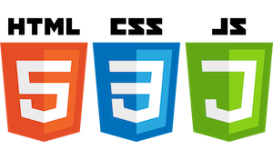

# CTEC3905: Front-End Web Development

**Dave Everitt**: deveritt@dmu.ac.uk  
**Fania Raczinski**: fania.raczinski@dmu.ac.uk

# Overview

- very popuar module with **limited spaces**
- final year module with **high expectations**
- covers **three languages** (plus markdown and git knowledge) at an intermediate to deep level

. . .

- goes **way beyond first year** modules
- **rapidly-evolving** field so the module is **intensive**
- no prerequisistes BUT **fast-paced** and **requires commitment**
- interim deadlines early on, **no latecomers** so **sign up now!**

## Deadlines

- **one assignment** 100% individual coursework
- **deadline** near the end before Winter break
- **interim submissions** which contribute to grade but are marked at the end

## Module structure

- 2 hour **labs** with exercises on GitHub
- 2 hour **lectures**, HTML and PDF slides, recorded

# What this module `!==`

Your prior knowledge may be **wrong** or **redundant!**

- **NO** Bootstrap/JQuery or CMS (e.g. Wordpress)
- **NO** following unapproved YouTube tutorials or templates
- **NO** teaching JavaScript frameworks but can guide you in this
- **NO** teaching Node or server-side content

## Basic misconceptions

Punishable by being sent to `dev/null`

- HTML5 is not XHTML!
- Javascript is not Java!
- GIT is not GitHub!

# Learning outcomes

1. Use GIT and GitHub for **version control** and **code storage**
2. Demonstrate a **critical understanding** of **Information Architecture**, user **interface design**, **usability** principles and **semantic markup**
3. Demonstrate evidence of a detailed **understanding** of all three **current front-end web technologies**, their use and **context**
4. Create a fully **standards-compliant**, **responsive** and **accessible** website or web-technology-based application

## Topics covered

1.	Design principles and user experience
2.	Information Architecture
3.	Usability, accessibility and WAIS
4.	HTML5, CSS3 amd semantic markup
5.	Modern JavaScript and its context
6.	Web languages for mobile development
7.	JSON as a data format
8.	Version control with GIT (and GitHub)

# What this module covers

- **JavaScript ES6** programming
- **CSS3** animations and advanced use such as flexbox, columns
- **HTML5** semantic tags and structure
- distinction between **semantic tags** and similarly-named **classes**
- **JSON data** and data **API**s
- mobile-first **responsive design**
- optional information on **progressive web apps**

## General good practice
- follows industry-standard coding style guide for front-end tech
- keeping code DRY e.g. really understanding CSS
- industry best practices against "what my mate does"
- code commenting

## Acessibility and design

- web accessibility principles
- information architecture and design principles
- wireframes, testing

# What is required

- **build on lab examples** not just copying lab code
- demonstrate a **proper understanding** of the **code**
- key **programming skills** including use of:
    - terminal
    - git
    - programmers' text editor
    - file system navigation
    - server requirements
- **version control** via GIT and GitHub/GitHub pages for the project delivery
- specific references to any **adapted source code** (MDN, W3Schools, CodePen, JSFiddle, etc.)

# Learning materials

- public **GitHub account** has all module code
- **UDL-freindly**, various formats, source and slides on GitHUb
- **selected** supplementary learning references
- dream team of **lecturers** :-)

